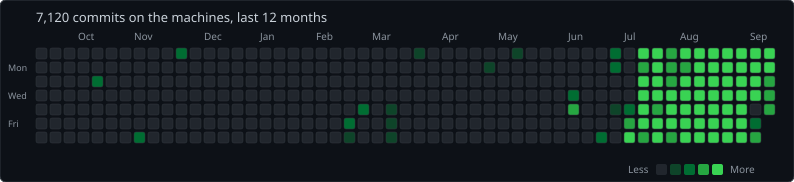

# Michael Needs

Director of [Gizmet Dev Ltd](https://gizmet.dev).

I build intelligence products and the tooling that runs them. Based in the United Kingdom. Remote. Open to offers.

Fault Line, SEKTR FUEL, Mycroft, Cate, and gizmet.dev. Counted from local git. The trees stay private.

### [Fault Line](https://fault-line.io)
Consumer geopolitical intelligence. The Brief, the Digest, and Extra.

### [SEKTR](https://sektr.dev)
An agentic development environment. One workspace, every harness.

### [GitGlory](https://gitglory.com)
Prestige from real git work. Ranks and history built on actual commits.

### [Gizmet Dev](https://gizmet.dev)
The company.

[gizmet.dev](https://gizmet.dev) · [fault-line.io](https://fault-line.io) · [sektr.dev](https://sektr.dev) · [gitglory.com](https://gitglory.com) · [@gizmet_dev](https://x.com/gizmet_dev)
